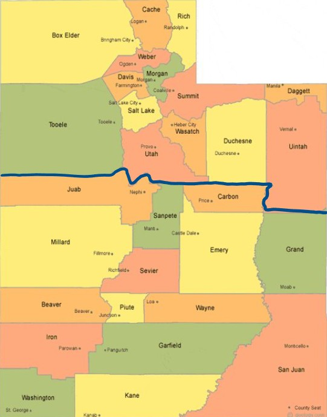

```{r setup, include=FALSE}
knitr::opts_chunk$set(echo = TRUE)
```

# Abstract

There are fireflies found throughout North America, though western states such as Utah have relatively few sightings. This is likely due to the eastern states having a more ideal climate for fireflies. We asked whether or not northern Utah with it's more abundant plant life, cooler temperatures, and greater access to reliable water has a higher observed population of fireflies than southern Utah. We received data via a citizen science project in across Utah. Results were analyzed with Shapiro-Wilk, Wilcoxon, and median tests.

# Background

Fireflies are found throughout North America, being the most prevalent in the Eastern United States. There are populations throughout the Western states as well, though their population distribution is not well documented. To amend this, a citizen science program was started to report sightings of fireflies throughout Utah. These sightings were recorded between 2014 and 2024, including the date, time, and general region of the sightings. Not all of this data was properly reported though, with some dates ranging as far back as 1964 (likely an unintentional error on the part of the reporter or recorder) and sighting numbers ranging from -3 to 1,000. We took this data and parsed through it, clarifying or removing data that was not of proper use to us before we began our analysis.

Previous studies have dived into the presence and identification of Utah fireflies, but have not done an analysis on the distributions of these fireflies (Kazama, 2007).

We included Box Elder, Cache, Rich, Weber, Morgan, Davis, Tooele, Salt Lake, Summit, Daggett, Utah, Wasatch, Duchesne, and Uintah counties in the northern Utah region. We included Juab, Sanpete, Carbon, Millard, Sevier, Emery, Grand, Beaver, Piute, Wayne, San Juan, Iron, Garfield, Washington, and Kane counties as the southern Utah region.

```{r} 
# Inserting reference image of Utah county North/South split

```

# Study questions and Hypothesis

## Question(s)

Do northen counties in Utah hav a higher abundance of fireflies compared to southern counties?

## Hypothesis

If geographic location affects firefly abundance, then northern populations will have a higher abundance compared to southern populations due to a higher level of vegetation and annual precipitation.

## Prediction

Northern Utah has lower summer temperatures and more abundant plant life. Therefore, I predict that there will be a higher number of firefly sightings in northern Utah than southern Utah.

# Methods and Results

This data on firefly populations was collected as a citizen science project and recorded on an Excel spreadsheet. We cleaned up this information by expanding abbreviations, clarifying or removing negative values that aught to have been positive, and removing irrelevant data (such as data from surrounding states). The sighting counts were then sorted between northern and southern counties as seen in the figure above.

Analysis through histograms, a violin plot, and a Shapiro-Wilk test showed that the firefly sighting counts did not fit a normal curve. Because of this, we used a Wilcoxon Test to determine the significance of differences in counts between the two regions. Finally, we compared medians of the two regions. 

The data was ultimately analyzed in R with a violin plot, a Shapiro-Wilk test, a Wilcoxon test, and a median comparison.

## First Analysis - Violin Plot

To analyze and aid in the visualization of the distribution of the data, we created a violin plot, which compares the distributions side-by-side. This allows for easy comparisons in curve shape, peaks, and location.

```{r}
# Split Violin Plot (y-axis limited to 50)r

library(ggplot2) #loading libraries
library(gghalves)
library(stringi)

# Reading data
fireflies <- read.csv("Copy of firefliesUtah - Usable Data.csv", stringsAsFactors = FALSE)
colnames(fireflies) <- c("firefly_count", "region")
fireflies<-na.omit(fireflies)

# Cleaning data
fireflies$region[fireflies$region == ""] <- NA
fireflies$region <- stri_trans_general(fireflies$region, "NFKC")
fireflies$region <- stri_replace_all_regex(fireflies$region, "\\p{C}", "")
fireflies$region <- gsub("\u00A0", " ", fireflies$region)
fireflies$region <- trimws(tolower(fireflies$region))
fireflies$region[fireflies$region %in% c("n", "nrth", "noth")] <- "north"
fireflies$region[fireflies$region %in% c("s", "sth", "soth")] <- "south"
fireflies$region <- factor(fireflies$region, levels = c("north", "south"))
fireflies_clean <- droplevels(subset(fireflies, !is.na(region)))

# Split violin plot
ggplot() +
geom_half_violin(
data = subset(fireflies_clean, region == "north"),
aes(x = factor(1), y = firefly_count, fill = region),
side = "l", trim = TRUE, color = "black", alpha = 0.7
) +
geom_half_violin(
data = subset(fireflies_clean, region == "south"),
aes(x = factor(1), y = firefly_count, fill = region),
side = "r", trim = TRUE, color = "black", alpha = 0.7
) +
scale_fill_manual(values = c("north" = "#8EC9E8", "south" = "#F4A261")) +
coord_cartesian(ylim = c(0, 50)) + # y-axis capped at 50
labs(
title = "Firefly Abundance: North vs South",
x = NULL,
y = "Firefly Count"
) +
theme_minimal(base_size = 13) +
theme(
legend.position = "bottom",
plot.title = element_text(size = 16, face = "bold", hjust = 0.5),
axis.text.x = element_blank(),
axis.ticks.x = element_blank()
)
```
This plot shows that there is little difference between the number of sightings in northern and southern Utah counties. It also demonstrates visually that that neither data set follows a normal curve.

## Second Analysis - Shapiro-Wilk normality test

Because of the irregularity of the data set, we performed a Shapiro-Wilk test to determine how well the data set fits a normal curve. This determined the other tests that would be used to analyze the data. In a Shapiro-Wilk normality test, the significance (shown by a p-value of less than 0.05) indicates how poorly the data fits a normal curve.

```{r}
shapiro.test(
  fireflies$firefly_count[fireflies$region == "south"]) #Shapiro-Wilk test to determine if South fits a normal curve
shapiro.test(
  fireflies$firefly_count[fireflies$region == "north"]) #Shapiro-Wilk test for North
```

In our data set, the southern counties have a p-value of 3.044e-16 and the northern counties have a p-value of 2.2e-16. This indicates a strong significance to the null hypothesis of the test, that the data does not follow a normal curve. Because of this, we used a wilcoxon test to determine the significance of the numerical differences between the two groups.

## Third Analysis - Wilcoxon Test and True Medians

Neither data set fitting a normal curve eliminates the relevance of many statistical tests that would typically be run on a data set such as this. A Wilcoxon test is a statistical test that is used to determine the significance in differences between data sets given that neither fits a normal curve. The lower the p-value, the lower the likely that differences in the data are due to chance. This indicates a significant difference between the two data sets.

We also analyzed the medians of the data to indicate if either trended a little higher.

### Wilcoxon Test 
```{r}
#accounting onlyfor north greater than south
wilcox.test(firefly_count ~ region, data = fireflies,
            alternative = "greater") #only accounts for "greater than" to reflect null hypothesis of more firefly sightings in Northern Utah than Southern Utah
```

### Finding the true North and South Medians
```{r}
tapply(fireflies$firefly_count, fireflies$region, median)
```

The Wilcoxon test yielded a p-value of 0.2794, which is far greater than the 0.05 threshold of significance. This indicates a failure to reject the null hypothesis that there is no significant statistical difference in the number of fireflies seen between northern and southern Utah counties (the alternative hypothesis being that the northern counties had a higher number of sightings).

The medians of both northern and southern counties being 4 supports that claim that there is no significant statistical difference between these two data sets.

#Discussion

## Interpretation of Analysis 1

The violin plot demonstrates the very similar distribution of reported firefly sightings across both northern and southern Utah counties. The overall shapes of the two data sets do not appear to match a normal distribution, implying that a specialized statistical test, such as a Wilcoxon test may be needed. To verify this, we performed a Shapirio-Wilk test.

## Interpretation of Analysis 2

Upon running the Shapiro-Wilk test, we received a p-value of 3.044e-16 for the northern counties and 2.2e-16 for the southern counties. This indicates that the neither data set resembles a normal curve and cannot be analyzed as such. We attempted using a number of other tests, including a quasi-poisson test, but due to the data's distribution, none of these were able to yield results with that meant anything. This is what lead us to turn to a Wilcoxon test to determine how well the two data sets matched one-another.

## Interpretation of Analysis 3

Results from our Wilcoxon test as well as the medians of our data both indicate that there is not significant difference in distribution between the two data sets. Our Wilcoxon test was targeting the specific question of if the northern region had a higher number of firefly sightings than the south. There was not only very little difference (indicated by a p-value of 0.2794), but the median of the two data sets was identical at 4. This supports the conclusion that there we were unable to find a statistically significant change in firefly sightings in northern and southern Utah.

## Limitations

The primary limitation we faced in this analysis was that the data came from a citizen science project and therefore results reflected the population density of any given region. This is something we expected, given these are reports from normal individuals as opposed to those seeking out fireflies. Because of this though, we received what is likely an inaccurate representation of the firefly population distributions in Utah.

There were a number of inconsistencies in the data as well such as being a location outside of Utah or a negative number of fireflies seen. The result of this was that there were a number of data points that we had to remove from our analysis. Given how high the Wilcoxon test results were, it is unlikely, however, that these data points would have made a significant difference.

# Conclusion

We found there to be no significant difference between the number of observed fireflies in northern and southern Utah counties. This does not support our hypothesis that northern Utah has more firefly sightings than southern Utah.  

If I were to repeat this analysis, I would attempt to focus on the counties rather than the regions of Utah. Due to the narrowing of category sized, this would likely give more varied results and could potentially shed more light on Utah firefly sighting distributions. 

Another point that could be studied in this topic is the relationship between firefly sightings and biomes or elevations and at which they are found to be highest. This could offer insight into which locations are most central to their survival as well as their life cycle in Utah and similar environments.

In the future, this data set could be used as a comparison for future firefly sightings/populations in Utah. This could shed light on ecological preservation efforts the overall health of Utah's various ecosystems.

# References

ChatGPT. OpenAI, version Jan 2025. Used as a reference for functions
such as plot() and to correct syntax errors. ​

Kazama, S., Matsumoto, S., Ranjan, S. P., Hamamoto, H., & Sawamoto, M.
(2007). Characterization of firefly habitat using a geographical information system with hydrological simulation. Ecological Modelling,
209(2-4), 392-400.​

Lewis, S. M., Wong, C. H., Owens, A. C., Fallon, C., Jepsen, S.,
Thancharoen, A., ... & Reed, J. M. (2020). A global perspective on firefly
extinction threats. BioScience, 70(2), 157-167.​

Natural History Museum of Utah. (n.d.). Fireflies of Utah – Citizen Science
Project. https://nhmu.utah.edu/citizen-science/fireflies​